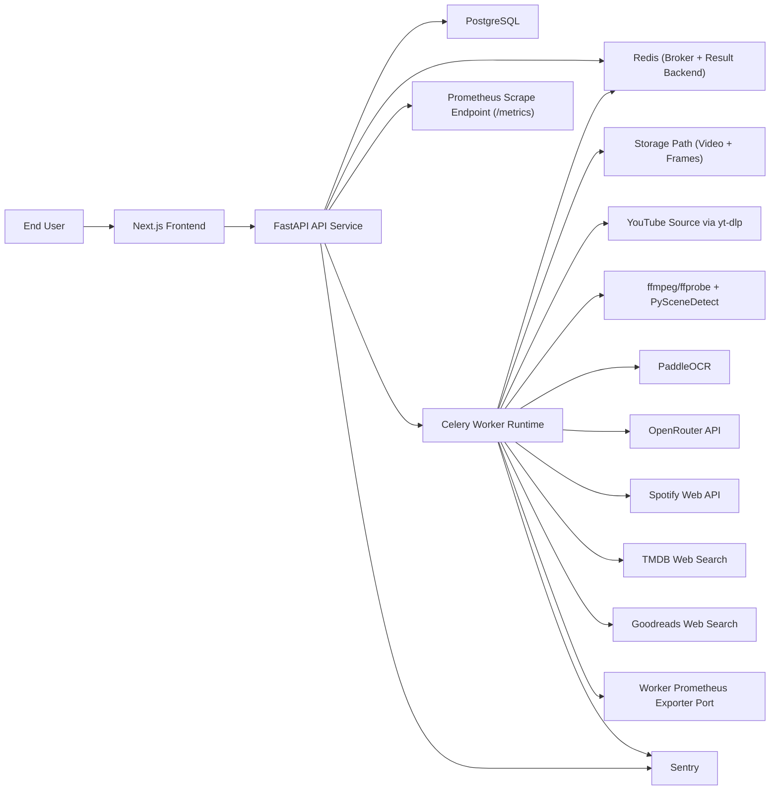
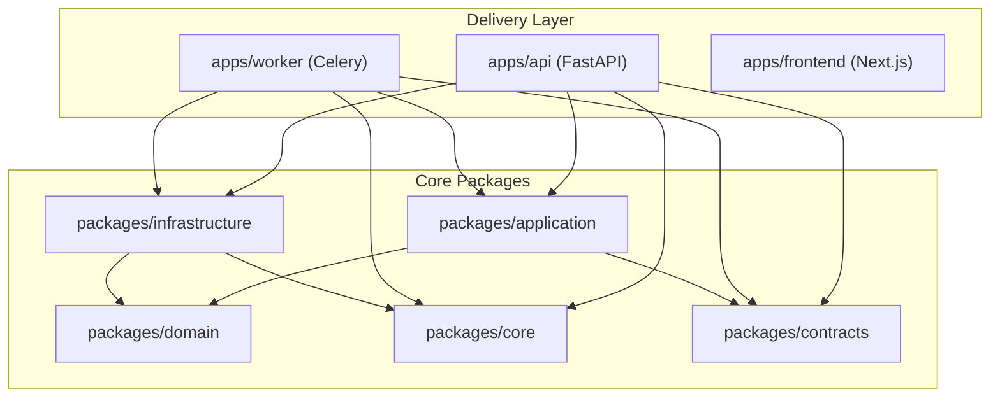
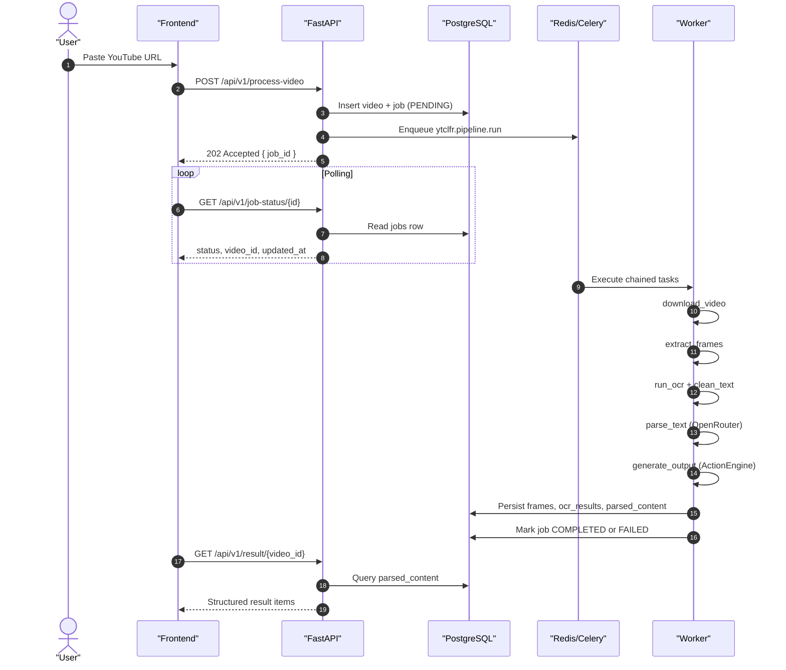
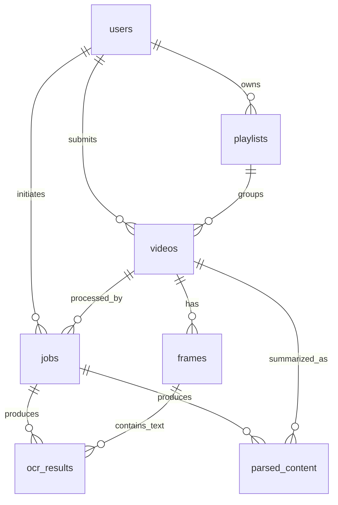

# YTCLFR

YTCLFR (YouTube To Cleaned, Linked, Filtered Results) converts a YouTube URL into structured knowledge using a production-oriented async pipeline:

- Video ingestion (`yt-dlp`)
- Frame extraction (`ffmpeg` + `PySceneDetect`)
- OCR extraction (`PaddleOCR`)
- Text normalization and deduplication (`RapidFuzz`)
- AI schema parsing (OpenRouter)
- Action generation (Spotify playlist, recipe JSON, TMDB links, Goodreads links)

This repository uses a clean architecture package split (`domain`, `application`, `infrastructure`, `delivery`) and is organized to evolve into microservices without major refactoring.

## Table Of Contents

- [1. Product Overview](#1-product-overview)
- [2. System Architecture](#2-system-architecture)
- [3. Repository Structure](#3-repository-structure)
- [4. End-To-End Workflow (MNC-Level)](#4-end-to-end-workflow-mnc-level)
- [5. Data Model](#5-data-model)
- [6. API Contract](#6-api-contract)
- [7. Full Setup Guide](#7-full-setup-guide)
- [8. Configuration Reference](#8-configuration-reference)
- [9. Monitoring, Logging, Error Tracking](#9-monitoring-logging-error-tracking)
- [10. Operations Runbook](#10-operations-runbook)
- [11. Testing Strategy](#11-testing-strategy)
- [12. Security And Reliability Notes](#12-security-and-reliability-notes)
- [13. Known Gaps And Next Steps](#13-known-gaps-and-next-steps)

## 1. Product Overview

### Primary Use Cases

1. Submit YouTube videos for asynchronous knowledge extraction.
2. Track processing state via job status.
3. Retrieve structured outputs for downstream consumption.
4. Generate action-oriented results by content type:
   - `music` -> Spotify playlist creation
   - `recipe` -> structured recipe JSON
   - `movie` -> TMDB search links
   - `books` -> Goodreads search links

### Core Capabilities

- Strict YouTube URL validation at API boundary.
- UUID-based records and timestamped auditable tables.
- Independent Celery pipeline stages with retries and failure propagation.
- Structured JSON logging for API and worker.
- Prometheus metrics for HTTP and Celery task performance.
- Optional Sentry integration for centralized exception tracking.

## 2. System Architecture

### 2.1 Context Diagram



### 2.2 Clean Architecture Layering



### 2.3 Processing Sequence Diagram



## 3. Repository Structure

```text
ytclfr/
|- apps/
|  |- api/                 # FastAPI delivery service
|  |- worker/              # Celery worker runtime and task orchestration
|  |- frontend/            # Next.js frontend (Home, Status, Result pages)
|- packages/
|  |- domain/              # Entities, value objects, repository contracts
|  |- application/         # Use cases and orchestration interfaces
|  |- infrastructure/      # DB, queue, OCR, AI, Spotify, video adapters
|  |- core/                # Config, logging, errors, monitoring
|  |- contracts/           # API/task pydantic models
|- infra/
|  |- compose/             # Docker Compose definitions
|  |- docker/              # Dockerfiles
|  |- k8s/                 # Kubernetes manifests (base)
|- docs/                   # Architecture and API notes
|- tests/                  # Shared test area (currently minimal)
|- alembic.ini             # Alembic configuration
|- .env.example            # Environment template
```

## 4. End-To-End Workflow (MNC-Level)

### 4.1 Ingestion Phase

1. Client submits `POST /api/v1/process-video` with `youtube_url`.
2. API validates URL format and YouTube host constraints.
3. API persists `videos` + `jobs` rows (UUID primary keys, timestamps).
4. API dispatches asynchronous pipeline root task to Celery via Redis.

### 4.2 Orchestration Phase

`ytclfr.pipeline.run` schedules a deterministic chain:

1. `download_video`
2. `extract_frames`
3. `run_ocr`
4. `parse_text`
5. `generate_output`

Each stage:

- Is independently retryable (`max_retries=3`).
- Emits structured logs.
- Updates DB status.
- Participates in timing/error metrics.

### 4.3 Processing Phase Details

1. Download
   - Uses `yt-dlp` subprocess.
   - Validates URL and checks duration against `MAX_VIDEO_DURATION`.
   - Stores artifacts under job-scoped storage directory.
2. Frame Extraction
   - One frame per detected scene change (`PySceneDetect`).
   - Plus one frame every 2 seconds.
3. OCR
   - Batch OCR with optional GPU support.
   - Confidence filtering before DB persistence.
4. Text Cleaning
   - Removes ranking noise, hashtags, watermark-like tokens, decorative symbols.
   - Applies fuzzy duplicate removal using `RapidFuzz`.
5. AI Parsing
   - Sends OCR text to OpenRouter.
   - Enforces strict schema validation and retries on invalid JSON.
6. Action Engine
   - Maps parsed content type to final actionable output.
   - Integrates Spotify workflow for music content when user token is configured.

### 4.4 Retrieval Phase

1. Status polling: `GET /api/v1/job-status/{id}`.
2. Final result retrieval: `GET /api/v1/result/{video_id}`.
3. Frontend surfaces job progression and structured items.

## 5. Data Model

### 5.1 ER Diagram



### 5.2 Tables

- `users`
- `videos`
- `frames`
- `ocr_results`
- `parsed_content`
- `playlists`
- `jobs`

All tables use:

- UUID primary keys
- `created_at` / `updated_at`
- Indexes for critical access paths (`status`, foreign keys, timeline fields)

## 6. API Contract

Base URL: `http://localhost:8000`

### 6.1 Core Endpoints

| Method | Path | Purpose |
|---|---|---|
| `GET` | `/api/v1/health` | Service health check |
| `POST` | `/api/v1/process-video` | Queue a new video processing job |
| `GET` | `/api/v1/job-status/{id}` | Poll status by job ID |
| `GET` | `/api/v1/result/{video_id}` | Retrieve parsed output by video ID |

### 6.2 Supplemental Endpoints

| Method | Path | Purpose |
|---|---|---|
| `POST` | `/api/v1/jobs` | Alternate job submission contract |
| `GET` | `/api/v1/jobs/{job_id}` | Alternate status endpoint |
| `GET` | `/api/v1/knowledge/{job_id}` | Knowledge retrieval by job ID |
| `GET` | `/api/v1/videos/supported` | Supported source list |
| `GET` | `/api/v1/spotify/status` | Spotify module status |

### 6.3 Example Calls

```bash
curl -X POST "http://localhost:8000/api/v1/process-video" \
  -H "Content-Type: application/json" \
  -d '{"youtube_url":"https://www.youtube.com/watch?v=dQw4w9WgXcQ"}'
```

```bash
curl "http://localhost:8000/api/v1/job-status/<JOB_ID>"
```

```bash
curl "http://localhost:8000/api/v1/result/<VIDEO_ID>"
```

## 7. Full Setup Guide

### 7.1 Prerequisites

- Python `3.11+`
- Node.js `20+` (for frontend)
- Docker + Docker Compose (recommended for infra services)
- `ffmpeg` / `ffprobe` available in worker runtime

### 7.2 Environment Setup

1. Create backend env file:
   - Copy `.env.example` to `.env`
2. Create frontend env file:
   - Copy `apps/frontend/.env.example` to `apps/frontend/.env.local`
3. Set required secrets:
   - `OPENROUTER_API_KEY`
   - `SPOTIFY_CLIENT_ID`
   - `SPOTIFY_CLIENT_SECRET`
4. Optionally set `SENTRY_DSN` and Spotify user token fields for playlist creation.

### 7.3 Option A: Docker Compose (Recommended)

```bash
docker compose -f infra/compose/docker-compose.yml up --build
```

Starts:

- PostgreSQL
- Redis
- API
- Worker

Frontend runs separately:

```bash
cd apps/frontend
npm install
npm run dev
```

### 7.4 Option B: Local Process Startup

1. Install Python dependencies:

```bash
pip install -e .
```

2. Export `PYTHONPATH`:

```bash
export PYTHONPATH="apps/api/src:apps/worker/src:packages/core/src:packages/contracts/src:packages/domain/src:packages/application/src:packages/infrastructure/src"
```

3. Run database migrations:

```bash
alembic upgrade head
```

4. Start API:

```bash
uvicorn ytclfr_api.main:app --host 0.0.0.0 --port 8000 --reload
```

5. Start worker:

```bash
celery -A ytclfr_worker.worker:celery_app worker --loglevel=INFO
```

6. Start frontend:

```bash
cd apps/frontend
npm install
npm run dev
```

## 8. Configuration Reference

### 8.1 Required Core Variables

- `DATABASE_URL`
- `REDIS_URL`
- `OPENROUTER_API_KEY`
- `SPOTIFY_CLIENT_ID`
- `SPOTIFY_CLIENT_SECRET`
- `STORAGE_PATH`
- `MAX_VIDEO_DURATION`

### 8.2 Monitoring/Logging Variables

- `SERVICE_NAME`
- `LOG_LEVEL`
- `LOG_FORMAT` (`json` or `text`)
- `METRICS_ENABLED`
- `WORKER_METRICS_PORT`
- `SENTRY_DSN`
- `SENTRY_TRACES_SAMPLE_RATE`

### 8.3 Runtime Variables (Selected)

- `YT_DLP_BIN`
- `FFMPEG_BIN`
- `OCR_USE_GPU`
- `OCR_BATCH_SIZE`
- `OCR_MIN_CONFIDENCE`
- `OPENROUTER_BASE_URL`
- `OPENROUTER_MODEL`
- `SPOTIFY_AUTH_URL`
- `SPOTIFY_API_BASE_URL`
- `SPOTIFY_USER_ID`
- `SPOTIFY_USER_ACCESS_TOKEN`

See `.env.example` for the complete set.

## 9. Monitoring, Logging, Error Tracking

### 9.1 Structured Logging

- JSON logs by default (`LOG_FORMAT=json`).
- API request logs include:
  - `request_id`, `http_method`, `path`, `status_code`, `duration_seconds`
- Worker task logs include:
  - `task_name`, `task_id`, retry/failure context, task duration

### 9.2 Prometheus Metrics

API exposes:

- `GET /metrics`
- HTTP request counters and latency histograms
- API error counters

Worker exposes:

- Prometheus exporter on `WORKER_METRICS_PORT` when enabled
- Task duration, retry, and failure metrics

### 9.3 Error Tracking

- Sentry integration is optional.
- Set `SENTRY_DSN` to enable.
- API and worker both capture unhandled exceptions with context.

## 10. Operations Runbook

### 10.1 Basic Health Validation

```bash
curl "http://localhost:8000/api/v1/health"
```

Expected: `{"status":"ok","timestamp":"..."}`

### 10.2 End-To-End Smoke Test

1. Submit `POST /api/v1/process-video`
2. Poll `GET /api/v1/job-status/{id}` until `COMPLETED` or `FAILED`
3. If `COMPLETED`, fetch `GET /api/v1/result/{video_id}`

### 10.3 Failure Handling Model

- Stage retries use exponential backoff (`2^n`, capped).
- Terminal failures mark job/video status `FAILED`.
- Error reason is persisted in `jobs.error_message`.

## 11. Testing Strategy

Current repository includes focused unit tests mainly under:

- `apps/worker/tests/unit`

Key covered modules:

- OCR engine parsing/filtering
- Text cleaner normalization/deduplication
- AI parser schema validation
- Spotify service behavior
- Action engine generation logic

Recommended command:

```bash
pytest apps/worker/tests/unit -q
```

## 12. Security And Reliability Notes

- No credentials are hardcoded; env-driven configuration only.
- API input uses strict Pydantic validation.
- OpenRouter output is schema-validated before trust.
- External commands (`yt-dlp`, `ffmpeg`) are failure-classified.
- Asynchronous long-running workloads are isolated in Celery workers.
- Persistent state changes are recorded in PostgreSQL with timestamps.

## 13. Known Gaps And Next Steps

1. Frontend currently consumes summarized `/result/{video_id}` items; exposing full `action_output` in API would improve downstream rendering fidelity.
2. Worker runtime must guarantee `ffmpeg`/`ffprobe` availability in the final deployment image.
3. CI/CD and security scanning pipelines should be added for enterprise rollout.
4. Add load/performance tests and synthetic monitoring for SLO enforcement.
# ytclfr-v2
